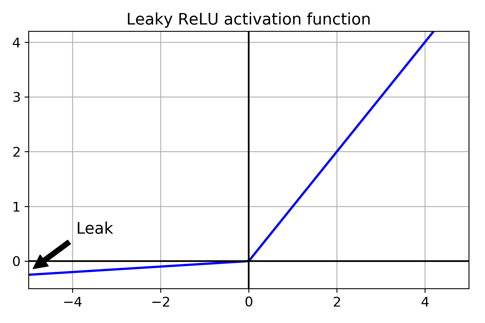

# AI Background knownledges

## Fishbook
## Handon-ML

----
**chap02**
### Prepare data
- Feature scaling
当数据集变化范围较大时，DL算法表现不好，可以做scaling

- regularization
### Fine Tune your models
- GridSearchCV RandomizedSearchCV

---
**chap10**
### 感知机
p292 为什么要有激活函数?  - 如果多层感知机之间没有非线性函数，那么再深的网络层级也可以用单一层级表示


### 如何计算MLP的参数数量
p300 每一层的参数为上一层输入的神经元个数×当前层神经元个数的权重+当前层bias数量，例如：
```text
Model: "sequential"
_________________________________________________________________
Layer (type)                 Output Shape              Param #   
=================================================================
flatten (Flatten)            (None, 784)               0         
_________________________________________________________________
dense (Dense)                (None, 300)               235500    
_________________________________________________________________
dense_1 (Dense)              (None, 100)               30100     
_________________________________________________________________
dense_2 (Dense)              (None, 10)                1010      
=================================================================
Total params: 266,610
Trainable params: 266,610
Non-trainable params: 0
```
### Callbacks
fit函数接收callbacks参数，用来制定需要保存的checkpoints，默认是每个epoch结束。如果有validation_set，可以选择保存最优的epoch,如下：

```(.cpp .numberLines)
checkpoint_cb = keras.callbacks.ModelCheckpoint("my_keras_model.h5", save_best_only=True)
history = model.fit(X_train, y_train, epochs=10,
                    validation_data=(X_valid, y_valid),
                    callbacks=[checkpoint_cb])
model = keras.models.load_model("my_keras_model.h5") # rollback to best model
```

也可以同时指定callback和early stop，early stop是说没有进展了就停止，此时可以指定很大的epoch，early stop会自动停止并回滚到best epoch，所以不需要回滚操作

### Tensorboard
tensorboard --logdir=./my_logs --port=6006

```
def get_run_logdir():
    import time
    run_id = time.strftime("run_%Y_%m_%d-%H_%M_%S")
    return os.path.join(root_logdir, run_id)

tensorboard_cb = keras.callbacks.TensorBoard(run_logdir)

%load_ext tensorboard
%tensorboard --logdir=./my_logs --port=6006
```

### Fine Tune Neural Network Hyperparameters
- 先用RandomizedSearchCV扫描一遍，然后用别的search方法在最优解附近搜索
- 业界也有很多比RandomizedSearchCV更好的搜索算法，例如Keras Tuner/skopt
- Google Cloud API also provide超参优化服务
- 超参优化仍然是正在研究的区域
#### 隐藏层数量
- 如果神经元足够多，一层隐藏网络也可以处理复杂问题，但是参数会很多，多层网络可以指数级降低对神经元数量的需求。因为多层网络可以服用之前的结果，与画一个森林类似
#### 隐藏层神经元的数量
- 输入输出层的数量由形状决定，中间隐藏层通常是金字塔型，低level多，高level神经元少
- 可以跟隐藏层数量一样慢慢增加隐藏层神经元数量直到overfit，但是更通常的做法是直接给一个大的数量，慢慢缩减。
- 反过来说，如果隐藏层神经元数量不够，则不能表示更多的特性，再深的网络也无济于事，例如两个神经元的隐藏层只能表示2D数据。
- 相比增加隐藏层神经元，更倾向于增加隐藏层数量

#### Learning Rate, Batch Size, Other HP
- Learning Rate, 通常最优解是最大解的一半。一般从一个比较小的lr开始，逐渐增加到一个比较大的值。调优过程中，会看到loss首先下降，然后上升，最优lr就是上升前的值
- optimizer
- Batch Size,大batch size通常导致训练初期不稳定

---
**chap11**
### 梯度消失问题
有时候梯度会越来越小,网络不收敛,称为梯度消失.有时候相反. 梯度越来越大,称为梯度爆炸, 在循环神经网络里会碰到.
- 使用不饱和激活函数.研究表明激活函数使用不当容易造成梯度消失. ReLU表现要好很多,因为正数的时候不会越来越小,而且容易计算.但是Relu也有问题，经常会碰到dying Relu，经常lr比较大的饿时候计算了负值，导致梯度为0. 为了避免这个问题，可以使用leaky Relu：

- 尽管使用He初始化好ELU等Relu变体可以显著减少梯度消失的问题，但是不能完全保证没问题。使用BN可以彻底解决这个问题。BN在隐藏层的激活函数前后。
    - 如果在神经网络的第一层之前使用了BN，则不需要standardize训练数据集，因为BN已经做过了
    - BN可以rescale并offset数据集，但是针对一个batch可能不准，可以等到整个数据集结束再计算，但是Keras决定使用动态的策略，动态计算。
    - Ioffe和Szegedy证明BN可以显著提高所有的DNN，使用BN的同时可以使用饱和的激活函数，例如tanh，而且对weight的初始化不敏感，并且可以使用较大的learning rate。
    - BN降低了对regularization的需求
#### Batch Normalization
- BN的参数数量：
```text
Model: "sequential_4"
_________________________________________________________________
Layer (type)                 Output Shape              Param #   
=================================================================
flatten_4 (Flatten)          (None, 784)               0         
_________________________________________________________________
batch_normalization (BatchNo (None, 784)               3136      
_________________________________________________________________
dense_212 (Dense)            (None, 300)               235500    
_________________________________________________________________
batch_normalization_1 (Batch (None, 300)               1200      
_________________________________________________________________
dense_213 (Dense)            (None, 100)               30100     
_________________________________________________________________
batch_normalization_2 (Batch (None, 100)               400       
_________________________________________________________________
dense_214 (Dense)            (None, 10)                1010      
=================================================================
Total params: 271,346
Trainable params: 268,978
Non-trainable params: 2,368
```
每个BN层对每一个input设置4个参数，所以第一层为784*4. 其中两个是non-trainable的。总共的non trainable参数是(3136+1200+400)/2

- BN层可配置的参数不多，经常配的只有。
    - momentum,表示更新指数平均值的时候使用
    - axis，进行BN操作的维度，默认最后一个维度
- BN层有可能被fixed-update weight初始化代替，但是还在研究过程总

#### gradient clipping
是一项防止梯度爆炸的技术，主要用在RNN中，因为BN在RNN中不太好用,在Keras中使用比较简单：
> optimizer = keras.optimizers.SGD(clipvalue=1.0)
上述优化器会把所有的gradient裁剪到-1到1之间

### 训练数据缺少标签
通常不会从头开始训练一个网络，而应该复用已经存在的神经网络的lower layer。不仅可以加速，而且需要的数据集也更少。output layer经常被替换。通常做法是：
- freeze所有的layer
- unfreeze 一到两个顶层的layer，查看反向传播后的性能
- 随着训练数据的增多，unfreeze更多层
具体方法参见keras.md, p347
所有的模型freeze和unfreeze之后都需要重新compile

#### Unsupervised pretraining
如果要训练一个复杂的网络，但是没有足够的带标签数据:
1. 尽量收集带标签数据
2. 进行无监督学习
3. 复用lower layer，并使用监督学习训练higher layer

### 利用优化器加速训练
- momentum optimization 
    gradient is for acceleration, not speed
- nesterov accelerated gradient
#### Learning rate
除了使用第10章讨论的从一个小的lr开始，指数级增加lr，直到学习曲线开始下降以外。也可以从一个较大的lr开始，逐渐缩小lr。所有的这些策略统称为learning schedule，常见的有：
- power scheduling
- exponential scheduling
- piecewise constant scheduling
- performance scheduling
- 1cycle scheduling
### 正则化技术


