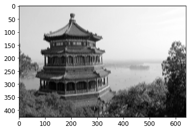

# AI Background knownledges

# Fishbook
# Handon-ML

----
**chap02**
## Prepare data
- Feature scaling
当数据集变化范围较大时，DL算法表现不好，可以做scaling

- regularization
    将数据限定在某一个范围内的预处理。
## Fine Tune your models
- GridSearchCV RandomizedSearchCV

---
**chap10**
## 感知机
p292 为什么要有激活函数?  - 如果多层感知机之间没有非线性函数，那么再深的网络层级也可以用单一层级表示


## 如何计算MLP的参数数量
p300 每一层的参数为上一层输入的神经元个数×当前层神经元个数的权重+当前层bias数量，例如：
model.summary()显示
```text
Model: "sequential"
_________________________________________________________________
Layer (type)                 Output Shape              Param #   
=================================================================
flatten (Flatten)            (None, 784)               0         
_________________________________________________________________
dense (Dense)                (None, 300)               235500    
_________________________________________________________________
dense_1 (Dense)              (None, 100)               30100     
_________________________________________________________________
dense_2 (Dense)              (None, 10)                1010      
=================================================================
Total params: 266,610
Trainable params: 266,610
Non-trainable params: 0
```
## Callbacks
fit函数接收callbacks参数，用来制定需要保存的checkpoints，默认是每个epoch结束。如果有validation_set，可以选择保存最优的epoch,如下：

```(.cpp .numberLines)
checkpoint_cb = keras.callbacks.ModelCheckpoint("my_keras_model.h5", save_best_only=True)
history = model.fit(X_train, y_train, epochs=10,
                    validation_data=(X_valid, y_valid),
                    callbacks=[checkpoint_cb])
model = keras.models.load_model("my_keras_model.h5") # rollback to best model
```

也可以同时指定callback和early stop，early stop是说没有进展了就停止，此时可以指定很大的epoch，early stop会自动停止并回滚到best epoch，所以不需要回滚操作

## Tensorboard
tensorboard --logdir=./my_logs --port=6006

```
def get_run_logdir():
    import time
    run_id = time.strftime("run_%Y_%m_%d-%H_%M_%S")
    return os.path.join(root_logdir, run_id)

tensorboard_cb = keras.callbacks.TensorBoard(run_logdir)

%load_ext tensorboard
%tensorboard --logdir=./my_logs --port=6006
```

## Fine Tune Neural Network Hyperparameters
- 先用RandomizedSearchCV扫描一遍，然后用别的search方法在最优解附近搜索
- 业界也有很多比RandomizedSearchCV更好的搜索算法，例如Keras Tuner/skopt
- Google Cloud API also provide超参优化服务
- 超参优化仍然是正在研究的区域
### 隐藏层数量
- 如果神经元足够多，一层隐藏网络也可以处理复杂问题，但是参数会很多，多层网络可以指数级降低对神经元数量的需求。因为多层网络可以服用之前的结果，与画一个森林类似
### 隐藏层神经元的数量
- 输入输出层的数量由形状决定，中间隐藏层通常是金字塔型，低level多，高level神经元少
- 可以跟隐藏层数量一样慢慢增加隐藏层神经元数量直到overfit，但是更通常的做法是直接给一个大的数量，慢慢缩减。
- 反过来说，如果隐藏层神经元数量不够，则不能表示更多的特性，再深的网络也无济于事，例如两个神经元的隐藏层只能表示2D数据。
- 相比增加隐藏层神经元，更倾向于增加隐藏层数量

### Learning Rate, Batch Size, Other HP
- Learning Rate, 通常最优解是最大解的一半。一般从一个比较小的lr开始，逐渐增加到一个比较大的值。调优过程中，会看到loss首先下降，然后上升，最优lr就是上升前的值
- optimizer
- Batch Size,大batch size通常导致训练初期不稳定

---
**chap11**
## 梯度消失问题
有时候梯度会越来越小,网络不收敛,称为梯度消失.有时候相反. 梯度越来越大,称为梯度爆炸, 在循环神经网络里会碰到.
- 使用不饱和激活函数.研究表明激活函数使用不当容易造成梯度消失. ReLU表现要好很多,因为正数的时候不会越来越小,而且容易计算.但是Relu也有问题，经常会碰到dying Relu，经常lr比较大的饿时候计算了负值，导致梯度为0. 为了避免这个问题，可以使用leaky Relu：

- 尽管使用He初始化好ELU等Relu变体可以显著减少梯度消失的问题，但是不能完全保证没问题。使用BN可以彻底解决这个问题。BN在隐藏层的激活函数前后。
    - 如果在神经网络的第一层之前使用了BN，则不需要standardize训练数据集，因为BN已经做过了
    - BN可以rescale并offset数据集，但是针对一个batch可能不准，可以等到整个数据集结束再计算，但是Keras决定使用动态的策略，动态计算。
    - Ioffe和Szegedy证明BN可以显著提高所有的DNN，使用BN的同时可以使用饱和的激活函数，例如tanh，而且对weight的初始化不敏感，并且可以使用较大的learning rate。
    - BN降低了对regularization的需求
### Batch Normalization
- BN的参数数量：
```text
Model: "sequential_4"
_________________________________________________________________
Layer (type)                 Output Shape              Param #   
=================================================================
flatten_4 (Flatten)          (None, 784)               0         
_________________________________________________________________
batch_normalization (BatchNo (None, 784)               3136      
_________________________________________________________________
dense_212 (Dense)            (None, 300)               235500    
_________________________________________________________________
batch_normalization_1 (Batch (None, 300)               1200      
_________________________________________________________________
dense_213 (Dense)            (None, 100)               30100     
_________________________________________________________________
batch_normalization_2 (Batch (None, 100)               400       
_________________________________________________________________
dense_214 (Dense)            (None, 10)                1010      
=================================================================
Total params: 271,346
Trainable params: 268,978
Non-trainable params: 2,368
```
每个BN层对每一个input设置4个参数，所以第一层为784*4. 其中两个是non-trainable的。总共的non trainable参数是(3136+1200+400)/2

- BN层可配置的参数不多，经常配的只有。
    - momentum,表示更新指数平均值的时候使用
    - axis，进行BN操作的维度，默认最后一个维度
- BN层有可能被fixed-update weight初始化代替，但是还在研究过程总

### gradient clipping
是一项防止梯度爆炸的技术，主要用在RNN中，因为BN在RNN中不太好用,在Keras中使用比较简单：
> optimizer = keras.optimizers.SGD(clipvalue=1.0)
上述优化器会把所有的gradient裁剪到-1到1之间

## 训练数据缺少标签
通常不会从头开始训练一个网络，而应该复用已经存在的神经网络的lower layer。不仅可以加速，而且需要的数据集也更少。output layer经常被替换。通常做法是：
- freeze所有的layer
- unfreeze 一到两个顶层的layer，查看反向传播后的性能
- 随着训练数据的增多，unfreeze更多层
具体方法参见keras.md, p347
所有的模型freeze和unfreeze之后都需要重新compile

### Unsupervised pretraining
如果要训练一个复杂的网络，但是没有足够的带标签数据:
1. 尽量收集带标签数据
2. 进行无监督学习
3. 复用lower layer，并使用监督学习训练higher layer

## 利用优化器加速训练
- momentum optimization 
    gradient is for acceleration, not speed
- nesterov accelerated gradient
### Learning rate
除了使用第10章讨论的从一个小的lr开始，指数级增加lr，直到学习曲线开始下降以外。也可以从一个较大的lr开始，逐渐缩小lr。所有的这些策略统称为learning schedule，常见的有：
- power scheduling
- exponential scheduling
- piecewise constant scheduling
- performance scheduling
- 1cycle scheduling
## 正则化技术
利用正则化可以消除部分过拟合
- l1 and l2 regularization
- dropout 
    - 在每一个training step，每个神经元有一定的概率会被忽略。下一个step有可能重新激活。原理是每一个丢掉部分神经元后的网络都有所不同，所以最终的网络是多个网络的融合。实际过程中，往往丢掉顶层的一到三层的神经元
    - 因为dropout发生在training过程中，所以比较training loss和validation loss有可能会误导。所以应该evaluate training loss without dropout
    - 如果看到模型过拟合，可以提高dropout rate
- Monte Carlo dropout
- max-norm regularization

## Notes
1. 不可以把所有权重初始化为同样的值，即使他们符合He初始化方法。因为这对导致对称性，而且反向传播不能打破这种对称性。
2. bias却可以初始化为0，不会有太大的影响

---
**chap12**

## Quick Tour
- TF operations在最底层都是通过高效的c++代码实现，有些算子有多个kernel实现，每个kernel对应一个硬件架构，比如CPU、GPU or TPU

## Use TF like Numpy
### Tensor and Operations
- Tensor是一个多维度的数组，也可以只有一个维度
- t.constant([1.],[3.])可以创建tensor
- Keras有自己的lower API，在keras.backend中。使用方式： 
>K = keras.backend \
> K.square(K.transpose(t)) + 10
```
t = tf.constant([1,2,3],[4,5,6])
t + 10
t.dtype
t.shape
tf.square(t)
tf.transpose(t)
tf.exp(t)
tf.sqrt(t)
tf.reshape(t)
```

### Constant
- tf和numpy的类型可以通用，例如：
> a = np.array([2.,3.,4.])
> b = tf.constant(a)\
需要注意的是numpy默认是64bit，tf是32bit
- tf.Tensor是常量，不可更改。所以不能用Tensor表示weight
### variable
类似tf.constant,tf.Varialble与numpy的操作也可以通用,但是Varialbe还可以进行assign，assign_add等操作改变值：
> v = tf.Variable([[1.,2.,3.,], [4.,5.,6.,]])
> v.assign(2*v)

### Other data structures
- tf.SparseTensor\
    tensor contains almost zero
- tf.TensorArray\
    a list of tensor
- tf.RaggedTensor\
    static list of tensors with same shape and type
- string tensors\
    tf.string
- sets\
    tf.constant([1,2],[3,4]) represent 2 set: {1,2}， {3,4}
- queues\
    tf.queue()

## customizing models and train algorithms
### custom loss functions
```
def huber_fn(y_true, y_pred):
    error = y_true - y_pred

models.compile(loss=hubber_fn, optimizer="nadam)
```
### save and loading models with custom component
- 自定义的组件可以被保存，然后调用，因为keras保存了字典，可以通过名字查找实际的函数

保存：\
model.save("my_model_with_a_custom_loss_threshold_2.h5")

加载：\
model = keras.models.load_model("xxxx.h5", custom_objects={"huber_fn": huber_fn})
- 以下列方式编译的model，保存的时候不会把参数进行保存：
model.compile(loss=create_huber(2.0), optimizer="nadam", metrics=["mae"])
- 如果需要保存需要创建keras.losses.Loss的子类，并重写构造函数、call()、get_config().其中get_config用来保存外部的参数名和内部成员变量的对应关系，return一个map
- 可以自定义losses, regularizers, constraint, initilizer, metrics, activation functions，layers, event models。但是这些自定义的内容的超参都不会在保存模型的时候被保存，如果需要保存需要继承keras.regularizers.Regularizer, keras.constraints.Constraint, keras.initializers.Initializer, keras.layers.Layer. 同样需要重写__init, __call__, get_config

### Metrics
loss和metric不同，loss必须是差异化的，而且不能为0，不用对人可读。metric则相反，只是一个评价，可以为0，必须人类可读。定义一个metric跟定义一个loss function一样

Precision通过两个变量计算准确率，为多个epoch累加的正确个数的累加，而不是准确率的平均
该对象也可以自定义，需要自定义的函数有：update_state, result, get_config, reset_states

### custom layers
如果是无weight的layer，可以实现lambda：
> exponential_layer = keras.layers.Lambda(lambda x: tf.exp(x))

如果是带权重的layer，需要继承自keras.layers.Layer，并重写以下函数：
* __init__
* build()
    首次使用layer的时候被调用，调用add_weight创建layer的变量
* call()
    期望的处理，比如dense为input和kernel相乘，并添加偏置
* compute_output_shape()
    返回output的shape，通常该函数可以别忽略，因为tf.keras会自动推导出输出形状

如果在training和testing的时候行为不同的自定义layer，需要为call函数增加training参数，使用该参数进行区分

### custom models
Model类是Layer类的一个子类，可以跟Layer一样定义和使用，但是有一些更多的派生函数，例如compile, fit, evaluate, predict, get_layer，save
如果希望保存，日后调用keras.models.load_model()，则需要使用以下两种方式的一种：
1. 在自定义model和自定义layer中实现get_config()。
2. 实现save_weights, load_weights

### Losses and Metrics based on internals
Loss和Metric不止可以用预测值计算，也可以用中间层的一些结果计算

### TF计算梯度
使用tf.GradientTape可以自动记录每一个用到变量的操作，最后可以导出：
```
w1, w2 = tf.Variable(5.), tf.Variable(3.)
with tf.GradientTape() as tape:
    z = f(w1, w2)

gradients = tape.gradient(z, [w1, w2])
```
这种方式很准确，而且只需要计算一次。 

### Tensorflow functions and Graphs
convert python function to tf function
```
def cube(x):
    return x ** 3
tf_cube = tf.function(cube)
```

as a decorator:
```
@tf.function
def tf_cube(x):
    return x ** 3

tf_cube(2)
```

可以使用python_function访问tf function的原生python function，例如
> tf_cube.python_function

通常tensorflow的函数比python的原生函数执行的更快，特别是当计算比较复杂的时候。

默认在Keras里自定义loss，metric，layer的时候自动转换为tf.function，如果不需要转换，需要设置dynamic=True, 或者在compile的时候设置run_eagerly=True

Graph可以重用，例如tf_cube(tf.constant(3))会生成一个int32类型的shape[]的graph，后面的调用都会复用这个类型。如果调用tf_cube(tf.constant(2,3))会生成新的graph。自动生成还有个前提是使用tf.constant作为参数，如果使用python原生的int作为参数，每一个不同的值都会生成一个新的graph，例如tf_cube(10), tf_cube(20)会生成两个。

如果使用python value多次调用tf function会生成多组tf graph占用内存，python value需要仅用于少数比较固定的值，例如超参。这样tensorflow可以优化每一个参数。

### AutoGraph and Tracing
TF生成图的逻辑是：
- AutoGraph: 分析control flow，例如for, while, if, return, break等。原因是python提供了__add__()/__mul__()等capture接口，但是没有__while__()/__if__()等接口
- 当分析结束后，将所有的control flow替换为tensorflow自己的operation，例如tf.while_loop(), tf.cond()
- Tensorflow会调用这些生成后的function。但是调用的时候不会传值，只会有name/data type/shape。成为graph mode，与eager mode相反
- 可以查看tensorflow生成的funciton:
> tf.autograph.to_code(tf_cube.python_function)

### TF function rules
- 如果调用了第三方库，例如numpy或者标准库，这些调用只会在tracing的时候运行，不出现在graph中。TensorFlow graph只由tf的结构组成，所以应该使用tf.reduct_sum()而不是np.sum()，tf.sort()而不是内置sorted()
- 如果tf函数调用了python函数或者tf function，那么这些函数会出现在图中，而且这些函数不需要使用@tf.function修饰
- 如果函数创建了tf varialble，只在第一次调用的时候创建，否则会用exception。通常不在tf function中创建。如果需要赋值，使用assign而不是=
- python函数的源码需要可见，如果不可见例如定义在shell中，则graph声场会失败
- 尽量使用vector而不是for loop

### Excercise
3. Tensorflow默认32bit，numpy默认64

---
**chap13**
目前为止都是利用内存中的数据训练网络，但是神经网络的数据集通常非常大，不适合放在RAM中。TF提供了Data API简化操作。Data API可以跟tf.keras无缝衔接。

Data API可以从csv，binary，TFRecord(Protobuf)， SQL database 读取数据。数据预处理可以写自己的预处理Layer，也可以用Keras提供的标准layer. TF系统中的预处理模块：
1. tf.Transform. 2. TFDS

## Dataset(tf.data)
```
// method 1
X = tf.range(10)
dataset = tf.data.Dataset.from_tensor_slices(x)

// method 2
dataset = tf.data.Dataset.range(10)
```
### chain transform
> dataset = dataset.repeat(3).batch(9)

切分前dataset的类型是RangeDataset，每个元素类型是：
>tf.Tensor(0, shape=(), dtype=int64)\
>tf.Tensor(1, shape=(), dtype=int64)

切分后是BatchDataset，每个元素类型是：
> tf.Tensor([0 1 2 3 4 5 6 7], shape=(8,), dtype=int64)

注意：dataset的method调用并不改变dataset本身，需要赋值

也可以用map函数针对每个元素调用自定义transform函数：
> dataset = dataset.map(lambda x: x * 2)

调用apply函数针对整个dataset进行操作(从batch转为range)：
> dataset = dataset.unbatch()

只取某几个元素：
> dataset.take(3)

### Shuffle
### Preprocess
decode_csv返回a list of scalar tensors(元素只有大小，没有方向), 可以通过tf.stack转换为1D tensor array

### Prefetching
调用dataset的prefetch方法，可以创建一个尽量做到prefetch一到两个batch（通过参数决定）的dataset。如果不确定prefetch数量，可以设置tf.data.experimental.AUTOTUNE让TF决定

## TFRecord Format
每个record包含 长度/length CRC/data/data CRC\
Write：
```
with tf.io.TFRecordWriter("my_data.tfrecord") as f:
    f.write(b"This is the first record")
    f.write(b"And this is the second record")
```
Read：
```
filepaths = ["my_data.tfrecord"]
dataset = tf.data.TFRecordDataset(filepaths)
for item in dataset:
    print(item)
```
Compress Write:
```
options = tf.io.TFRecordOptions(compression_type="GZIP")
with tf.io.TFRecordWriter("my_compressed.tfrecord", options) as f:
    f.write(b"This is the first record")
    f.write(b"And this is the second record")
```

Compress Read:
```
dataset = tf.data.TFRecordDataset(["my_compressed.tfrecord"],
                                  compression_type="GZIP")
for item in dataset:
    print(item)
```

---
**chap14**

## Convolution Layer
一层由相同filter组成的layer输出的东西层成为feature map，highlight了最能激活filter的部分

filter多个导出多个feature map，同一个feature map share一个filter
input多个成为多个input channel
### TF implementation
```
A mini-batch: b, h, w, channel
china = load_sample_image("china.jpg") / 255
flower = load_sample_image("flower.jpg") / 255
images = np.array([china, flower])
batch_size, height, width, channels = images.shape
```

china.shape = 427, 640, 2其中427和640是h，w， 2是channel

创建filter：
```
filters = np.zeros(shape=(7, 7, channels, 2), dtype=np.float32)
filters[:, 3, :, 0] = 1  # vertical line
filters[3, :, :, 1] = 1  # horizontal line
```
通过如下对nn的调用
>  outputs = tf.nn.conv2d(images, filters, strides=1, padding="SAME")
如果stride是1，output的shape是(2, 427, 640, 2)
如果stride是2，output的shape是(2, 214, 320, 2)


可以得到：
plt.imshow(outputs[0, :, :, 0], cmap="gray") # plot 1st image's 2nd feature map



通常filter不需要自己创建，CNN自己学习一个出来，filter是一个trainable的参数。 

卷基层的参数不多，主要有filter的数量，h, w, stride, padding type

## Pooling layer
polling跟卷积类似，但是没有权重，只是把所有的input聚集起来，取最大值或者平均值。

polling layer可以引入不变性，当输入有稍许位移的时候，输出并没有变化。在CNN中，可以屏蔽部分不重要的细节。

创建一个pooling layer：
> max_pool = keras.layers.MaxPool2D(pool_size=2)

depthwise max pooling

> depth_pool = keras.layers.Lambda(lambda X: tf.nn.max_pool(
    X, ksize=(1, 1, 1, 3), strides=(1, 1, 1, 3), padding="VALID"))

global average pooling layer:
每一个feature map输出一个值，主要用在输出层

## CNN Architectures
CNN网络由多个卷基层+ pooling层+Relu组成，最后可能会接一个全连接网络。 一个常见的错误是使用太大的kernel，使用较小的kernel可以减小计算量，结果也会更好

卷基层的参数数量： kernel h * w + 1(bias) * filter number(feature map): 
for model:
```
model = keras.models.Sequential([
    DefaultConv2D(filters=64, kernel_size=7, input_shape=[28, 28, 1]),
    keras.layers.MaxPooling2D(pool_size=2),
    DefaultConv2D(filters=128),
    DefaultConv2D(filters=128),
    keras.layers.MaxPooling2D(pool_size=2),
    DefaultConv2D(filters=256),
    DefaultConv2D(filters=256),
    keras.layers.MaxPooling2D(pool_size=2),
    keras.layers.Flatten(),
    keras.layers.Dense(units=128, activation='relu'),
    keras.layers.Dropout(0.5),
    keras.layers.Dense(units=64, activation='relu'),
    keras.layers.Dropout(0.5),
    keras.layers.Dense(units=10, activation='softmax'),
])
```
```
_________________________________________________________________
Layer (type)                 Output Shape              Param #   
=================================================================
conv2d_8 (Conv2D)            (None, 28, 28, 64)        3200      
_________________________________________________________________
max_pooling2d_4 (MaxPooling2 (None, 14, 14, 64)        0         
_________________________________________________________________
conv2d_9 (Conv2D)            (None, 14, 14, 128)       73856     
_________________________________________________________________
conv2d_10 (Conv2D)           (None, 14, 14, 128)       147584    
_________________________________________________________________
max_pooling2d_5 (MaxPooling2 (None, 7, 7, 128)         0         
_________________________________________________________________
conv2d_11 (Conv2D)           (None, 7, 7, 256)         295168    
_________________________________________________________________
conv2d_12 (Conv2D)           (None, 7, 7, 256)         590080    
_________________________________________________________________
max_pooling2d_6 (MaxPooling2 (None, 3, 3, 256)         0         
_________________________________________________________________
flatten_1 (Flatten)          (None, 2304)              0         
_________________________________________________________________
dense_3 (Dense)              (None, 128)               295040    
_________________________________________________________________
dropout_2 (Dropout)          (None, 128)               0         
_________________________________________________________________
dense_4 (Dense)              (None, 64)                8256      
_________________________________________________________________
dropout_3 (Dropout)          (None, 64)                0         
_________________________________________________________________
dense_5 (Dense)              (None, 10)                650       
=================================================================
Total params: 1,413,834
Trainable params: 1,413,834
Non-trainable params: 0
```

### Data augmentation(数据扩充)
数据扩充人为的增加了训练集的大小，给每个训练数据增加了变量，可以用来减少过拟合


