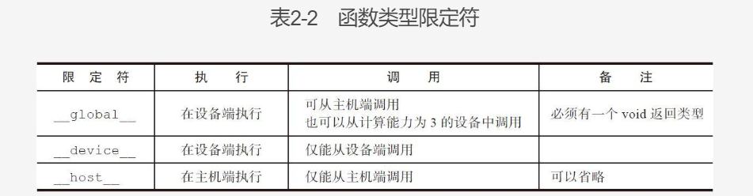

# CUDA(Compute Unified Device Architecture)

## Professional CUDA C
### Flynn's Taxonomy
- SISD(Single Instruction Single Data)
- SIMD
- MISD
- MIMD

### Measurements
- 延迟 - 一个操作从开始到完成的时间
- 带宽 - 单位时间可以处理的数据量 GB/s
- 吞吐量 - 单位时间成功处理的运算数量 gflops

### threads
- Grid - share Global Memory
- Block - Contain several wraps. A Block share Shared Memory and keep sync

### Async
- kernel launch is async, but some is sync, like cudaMemcpy

### Function type
- device and host could be used at the same time




### Device Management
two ways to query and manage GPU device:
- CUDA Runtime API
- nvidia-smi
   - nvidia-smi -q -i 0
   - nvidia-smi -q -i 0 -d MEMORY
   ```text
       -d,   --display=            Display only selected information: MEMORY,
                                       UTILIZATION, ECC, TEMPERATURE, POWER, CLOCK,
                                       COMPUTE, PIDS, PERFORMANCE, SUPPORTED_CLOCKS,
                                       PAGE_RETIREMENT, ACCOUNTING, ENCODER_STATS,    FBC_STATS
   ```

### Set Device in Runtime
CUDA_VISIBLE_DEVICES=2,  3

### GPU Arch
- XXX threads per SM
- X SM per GPU
- wrap is 32 threads
   - all thread execute same code while has its own counter and regs
   - one wrap could be on only one SM
   - synced in warp, not between wrap
- Kernel's wrap will be assigned to a free SM
- Multi wrap could be on same SM at the same time
- Instruction in same thread pipelined
- SIMT execute same code but on different data. SIMD vs SIMT
   - own pc
   - own reg
   - own execution path

### Fermi
-每个SM 中包含：
   - 2个 Warp Scheduler/Dispatch Unit
   - 32个CUDA Core(分在两条 lane 上，每条分别是16 个)
   - 每个CUDA Core 里面是1个单精浮点单元(FPU)和1个整数单元(ALU)，可以直接做FMA的乘累加
   - 每个cycle可以跑16个双精的FMA
   - 16个LD/ST Unit
   - 4个SFU

### Synchronize
cudaDeviceSynchronize用来阻塞主机应用程序，直到所有的CUDA操作完成

### Metrics
achieved_occupancy 每个周期内活跃的线程数与SM最大支持的比率

ON 3.5


