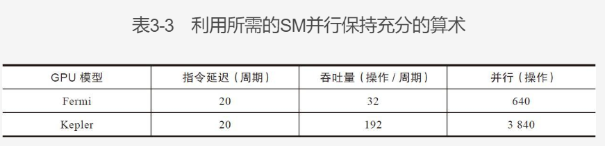
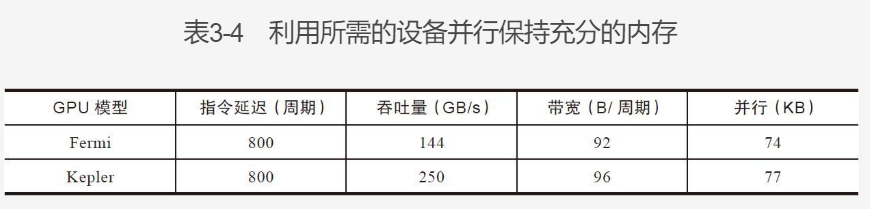

#  Performance Tuning Notebook

## Background Knowledge

## Tuning High level
- Target
   - improve function
   - improve performance
   - select correct metrics
   - check the differece between real measurements and ideal

- Profiling 
   - memory and time complexity
   - special instruction usage
   - function called frequency and duration

- 3 common restrictions
   - storage bandwidth
   - compute resource
   - instruction and memory latency

- Event 
   - activity could be counted
   - coresponded to a HW counter
   - reported by SM
   - serveral event could be counted in a single run, some are  mutex 

 - Metric
   - charactistics, calculated by Event

## Tuning low level
**CUDA**

- Branch divergence
   - use difference flow in same wrap will cause divergence
   - divergenced branch execute one by one
   - modify branch split to avoid branch divergence
   - could be avoid

- Resource allocation
   - wrap need pc/register/shared memory
   - the more reg a thread needed, the less thread number per SM
   - decrease reg needed will increase wrap numbers could be parsed simulately

- latency
   - arithmetic isntruction(10-20 cycles)
      - cycles between arithmetic issued and output
   - memory instruction(400-800 cycles)
      - cycles between load/store issued and data arrived

- Throughput and BW
BW is therotical, throughput is realatic. 
   - BW is the max data transferred count
   - througput is spead of execution per second

- why we need paralell
   - for arithmetic op, it's the operation count to hide the op execute latency

   - for memory op, it's the bytes count to hide memory latency


   ```text
   (base) yangtian@AlgServer:/home/devdata/jimmy/CodeSamples/chapter03$ nvidia-smi -q    -d CLOCK -i 0  | fgrep -A 3 "Max Clocks"
       Max Clocks
           Graphics                    : 1530 MHz
           SM                          : 1530 MHz
           Memory                      : 877 MHz
   ```

   - for Fermi, memory BW is 144GB/s, clock is 1.566GHz, so GB/cycle is:
     144GB/s、1.566GHz = 92B/cycle
   - for 4B/thread, Fermi need 74KB / 4B/thread = 18500 thread
   - 18500 threads / 32 thread/wrap = 579 wrap
   - 579 wrap / 16 SM = 36 wrap / SM
- 3.2.5
- 3.3
