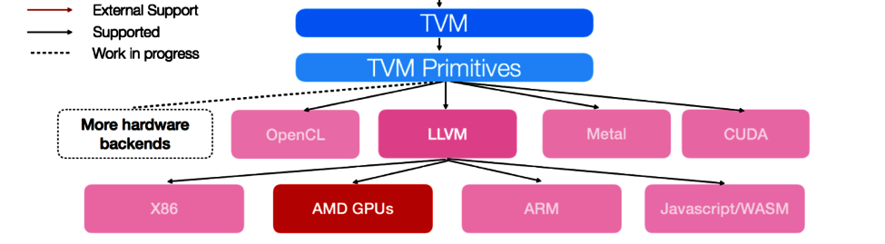

# TVM study

## Tutorials
- Unlike traditional deep learning frameworks. TVM stack is divided into two major components:

    TVM compiler, which does all the compilation and optimizations

    TVM runtime, which runs on the target devices.


- TVM support list



- compile 
>relay.build() returns three components: the execution graph in json format, the TVM module library of compiled functions specifically for this graph on the target hardware, and the parameter blobs of the model. During the compilation, Relay does the graph-level optimization while TVM does the tensor-level optimization, resulting in an optimized runtime module for model serving.

>We’ll first compile for Nvidia GPU. Behind the scene, relay.build() first does a number of graph-level optimizations, e.g. pruning, fusing, etc., then registers the operators (i.e. the nodes of the optimized graphs) to TVM implementations to generate a tvm.module. To generate the module library, TVM will first transfer the high level IR into the lower intrinsic IR of the specified target backend, which is CUDA in this example. Then the machine code will be generated as the module library.

- Computation 
> TVM用多维度array保存中间结果，用户需要描述生成tensor的规则

- Schedule
> A schedule is a set of transformation of computation that transforms the loop of computations in the program.

- Flow
1. Describe the computation
```
n = te.var("n")
A = te.placeholder((n,), name="A")
B = te.placeholder((n,), name="B")
C = te.compute(A.shape, lambda i: A[i] + B[i], name="C")
print(type(C))
```
2. schedule the compuation
```
s = te.create_schedule(C.op)
bx, tx = s[C].split(C.op.axis[0], factor=64)
if tgt == "cuda" or tgt == "rocm" or tgt.startswith("opencl"):
    s[C].bind(bx, te.thread_axis("blockIdx.x"))
    s[C].bind(tx, te.thread_axis("threadIdx.x"))

```
3. compile
The build function takes the schedule, the desired signature of the function (including the inputs and outputs) as well as target language we want to compile to.
```
fadd = tvm.build(s, [A, B, C], tgt, target_host=tgt_host, name="myadd")
```
4. The result of compilation fadd is:
1: a GPU device function (if GPU is involved) 
2: a host wrapper that calls into the GPU function. 
fadd is the generated host wrapper function, it contains a reference to the generated device function internally.

5. The following code first performs the following steps:
    - It saves the compiled host module into an object file.
    - Then it saves the device module into a ptx file.
    - cc.create_shared calls a compiler (gcc) to create a shared library
6. load the module
```
fadd1 = tvm.runtime.load_module(temp.relpath("myadd.so"))
if tgt == "cuda":
    fadd1_dev = tvm.runtime.load_module(temp.relpath("myadd.ptx"))
    fadd1.import_module(fadd1_dev)
```

- Getting Started with TVM command line driver - TVMC


